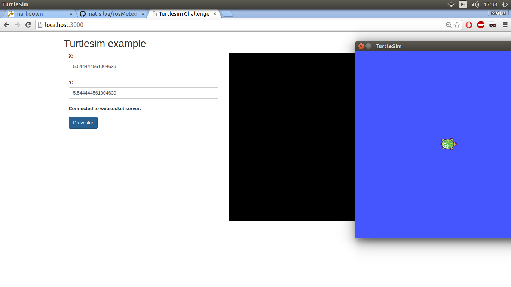
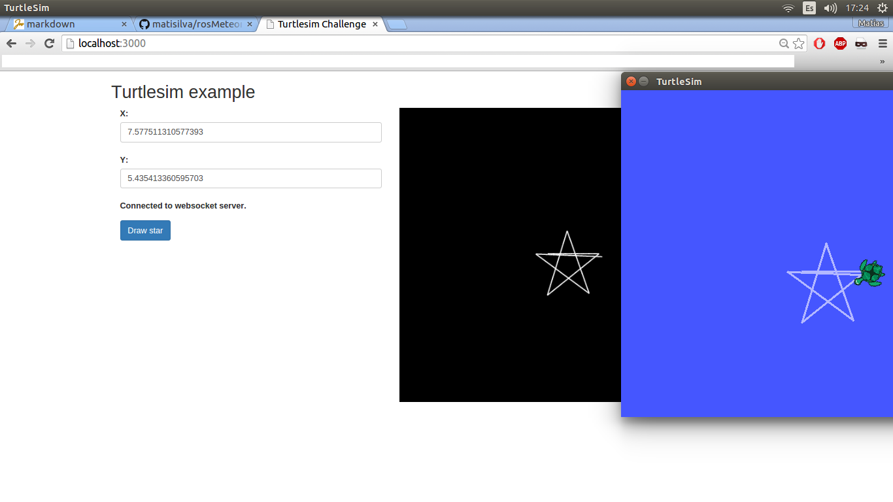

# Proyecto ROS + Meteor
=======================
El siguiente desafio consta de replicar el movimiento de una tortuga simulada en un host sobre una pagina web a traves de un servidor. En este caso utilizamos Meteor para levantar el servidor y turtlesim para simular.

El movimiento sera ejemplificado con una estrella cuyos movimientos seran mandados a través de la pagina web. A su vez al moverse la tortuga en el simulador, las señales enviadas seran captadas por el servidor y seran replicadas en la misma pagina web.

Se utilizaran como interfaz los topicos sugeridos.

**/turtle1/pose**: para replicar los movimientos
**/turtle1/cmd_vel**: para generar los movimientos

Ejemplo de una instruccion de movimiento por consola 
```
$ rostopic pub /turtle1/cmd_vel geometry_msgs/Twist -r 1 -- '[0.0,0,0]' '[0.0,0,2.5]'
```


## ¿Como verificar el funcionamiento?
Para ver el funcionamiento deberan correrse los siguientes pasos..

* Creo el nucleo
```
$ roscore
```

* Creo el nodo en modo simulacion con turtlesim
```
$ rosrun turtlesim turtlesim_node __name:=miTortuga
```

* Levanto el servidor de ROS (aqui se recibiran los paquetes dirigidos al core)
```
$ roslaunch rosbridge_server rosbridge_websocket.launch
```

* Luego de ingresar en la carpeta ```/meteorServer```
```
$ meteor
```

* En este paso deberan tener tanto el servidor ROS(9090) como Meteor(3000) corriendo..
* En un navegador web ingresar
```
http://localhost:3000
```
##Screen captures




